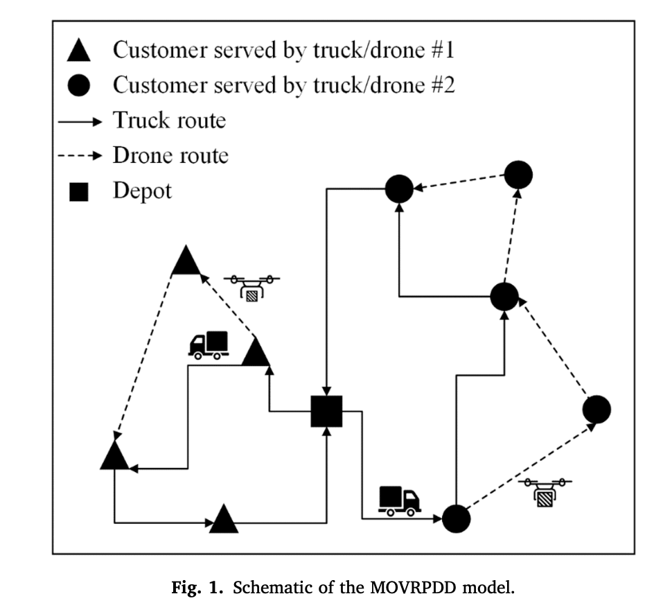
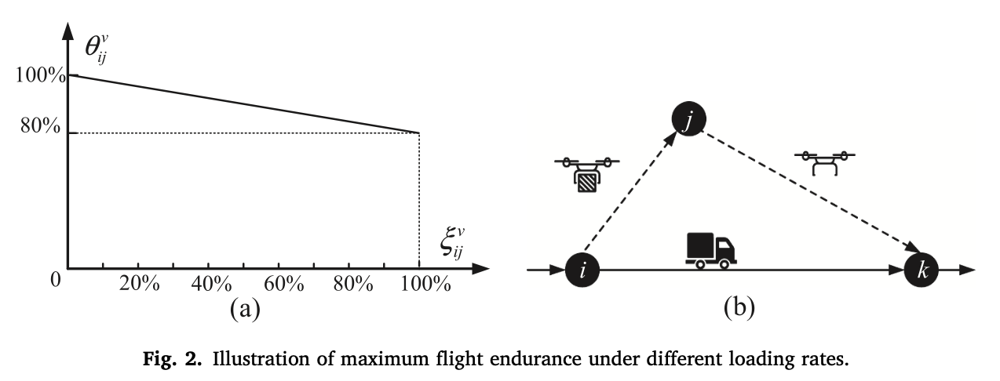
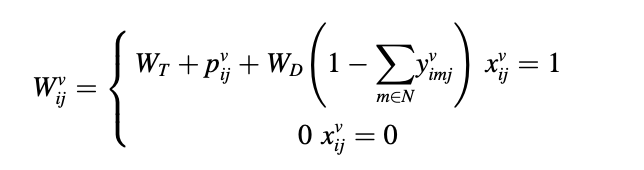
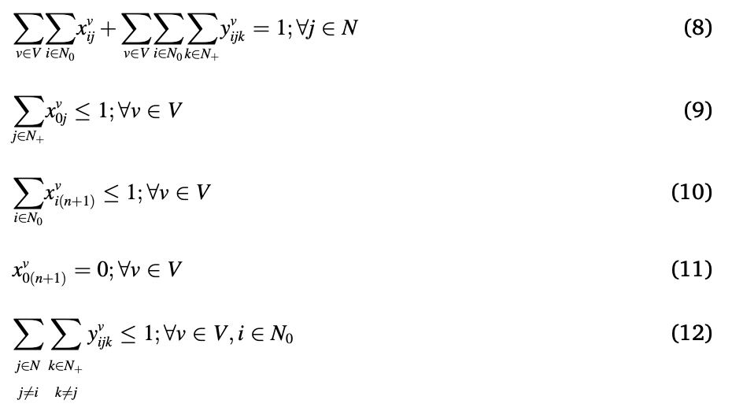
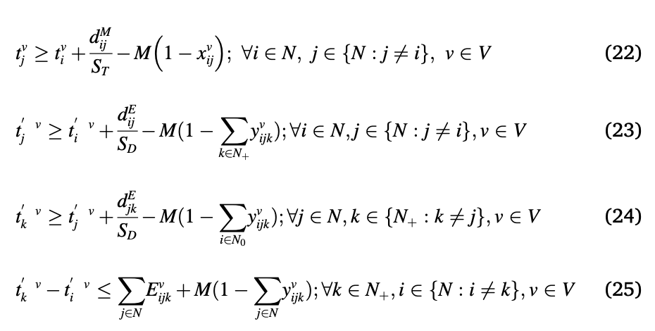

# Notes On Research Paper

NOTE: USE control+shift+v to open this markdown in formatted style (i.e. pdf style)

## 1 Introduction
* Trasnportation sector responsible for 26.4% of global carbon emissions
* 2 main trends in reducing emissions:
  * Electrify transportation (problem: recharging stations must be deployed along routes)
  * Minimise total energy consumption (related to CO2 emissions) through optimisation (problem: this doesnt necessaerily lead to maximal economic benefit)
* Drones provide economic benefits as they are autonomous (no labour costs)
  * Must be combined with trucks to overcome endurance and load capacity reducing both delivery times and costs
  * This study is novel as it tries to minimise both environmental and economic impact (up untill now, studies mostlyfocus on one of the other)
    * 2 economic objectives: total delivery costs & delivery time
    * 1 environmental objective: total energy consumption
* Main paper contributions:
  1. Accounts for both environemntal and economic impacts
  2.  Dynamically adjusts maximum flight endurance of drones based on loading rate
  3.  An extended non-dominated sorting genetic algorithm is proposed

## 2 Multi-objective vehicle routing problem with drone delivery and dynamic flight endurance

### 2.1 Problem Statement
Figure 1 illustrates the multi-objective optimization model for the vehicle routing problem with drone delivery (MOVRPDD).
1. Fleet of trucks leaves the depot to serve all customers sequentially.
2. Each truck has a drone and can serve customer in two ways:
   1. Serving the customer directly
   2. Launching/retrieving drone
3. Minimise for multiple trucks and drones:
   1. Total delivery costs
   2. Total delivery time
   3. Total energy consumption

The MOVRPDD model uses the following assumptions:
1. Max. flight endurance of drone is dynamic and is based on loading rate of drone
2. Launching/retreival times of drone are ignored
3. Truck routes measured using **manhattan distance** (not shortest distance between two nodes, rather think of following grid lines at right angles to get from one node to another) due to restrictions of urban road networks
4. Drones travel in straight lines between two nodes: route measured using **euclidean distance**.
5. Drone routes only account for horizontal travel, not vertical travel (i.e. only x-y plane)
6. Drone cannot be relaunched before it is retrieved

### 2.2 Mathematical Model
See p.3 of paper for full nomencalture.

xijv:1 if truck v travels from i to j, else 0

yijkv: 1 if drone on truck v is launched at i, serves customer at j, is retrieved at node k, else 0

&zeta;ijv: loading rate of drone v going from i to j

&theta;ijv: Dynamic scaling factor of max flight endurance of drone

qj: demand for customer node j

QD: load capacity of drones

Eijkv: expected max. endurance of drone v when serving customer j, launched from node i, retrieved at node k

Wijv: gross weight of truck v going from node i to customer j

#### Calculation of intermediate variables

Loading rate: &zeta;ijv = qj&frasl;QD if drone v is launched from node i and serves customer j (i.e. &sum; {k &isin; N}(yijkv) = 1), else = 0

The loading rate can then be used to calculate scaling factor:

Scaling Factor: &theta;ijv = 100% - 0.2 * &zeta;ijv

Using these values, the expected max flight endurance of drone can be calculated as:

Where E is max drone endurance when empty

Finally the gross weight of the truck is calculated as follows:

Where WT is tare (empty) weight of truck, pijv is weight of payload, WD is tare (empty) drone weight and yimjv=1 means that drone has been launched (i.e. is not on truck).

#### Objective Functions

Where:
1. f1 is the environmental objective, used to minimise total energy consumption (only considers trucks as drones are electric; negligible impact on environemnt)
2. f2 is the total delivery cost objective:
3. f3 is total delivery time objective

#### Contstraints

The 3 figures below show the mathematical formulation of all the contraints:

Here, i will give an explanation of each contraint (note some of these are done with help of GPT so dont forget to change wording in report):

* Constraint 8: Ensures each customer is served by either a truck or a drone.
  
**Contraints 9 to 11 have to do with truck arriving/leaving depots**

* Constraint 9: Ensures each truck leaves the depot at most once
  
* Constraint 10: Ensures that each truck arrives at the depot at most once
  
* Constraint 11: Ensures trucks dont travel directly from depot to depot
  
**Contraint 12 and 13 to do with drone launch/retrieval**

* Constraint 12: Ensures each drone is launched at most once at all customer and depot nodes (GPT: "prevents multiple drone operations from a single node for each vehicle, making sure that a drone is involved in only one delivery mission at a time before it has to be retrieved.").

* Constraint 13: Ensures each drone is retrieved at most once at all customer and depot nodes.

**Contraint 14 and 15 to do with payload capacity of trucks and drones**

* Constraint 14: Esnures drones are not loaded beyond its load capacity during flight.

* Constraint 15: Ensures each truck does not exceed its load capacity during entire delivery route.

**Contraint 16 and 17 are logic (physical) contraints**

* Constraint 16: Ensures that if drone is launched at node i and retrieved at node k, the truck must also pass through both nodes to launch/retrieve the drone.

* Constraint 17: Ensures delivery sequence of trucks is consistent with that of the drones (GPT: "This constraint ensures that if a drone is deployed for a mission from node i to j and retrieved at node k, the truck must visit node i before node k. Essentially, it ties the truck's routing to the drone's operations, ensuring that the sequence of visits is logically consistent with the drone's deployment and retrieval.").

**Contraint 18 and 19 are to do with launch times of drones**

* Constraint 18: Launch time of drone at node i cannot be earlier than arrival time of the truck at same node **unless** drone is not launched at node i (big M constant negates this constraint in this case)

* Constraint 19: Launch time of drone at node i cannot be later than arrival time of the truck at same node **unless** drone is not launched at node i (big M constant negates this constraint in this case)

**Contraint 20 and 21 to do with drone retrieval times (avoid waiting times between drones and trucks)**

* Constraint 20: Ensures drone retrieval time at node k is not earlier than truck's arrival at that node.

* Constraint 21: Ensures drone retrieval time at node k is not later than truck's arrival at that node.
  
**Constraint 22 to 25 to do with timing logic**

* Constraint 22: Ensures arrival time of truck at node j is after departure time from node i based on manhattan distance dijM. Big M deactivates constraint if there is no direct link between the two nodes.

* Constraint 23: Ensures arrival time of drone at node j is after departure (launch) time from node i based on euclidean distance dijE. Big M deactivates constraint if drone doesnt make direct trip between the two nodes.

* Constraint 24: Ensures that the time of retrieval at node k occurs after the time of delivery of the drone at node j based on euclidean distance dijE. Big M deactivates constraint if drone doesnt make direct trip between the two nodes. 

* Constraint 25: Ensures total flight time of drone is less than its maximum endurance. Big M deactivates constraint if drone doesnt make direct trip between the two nodes. 

